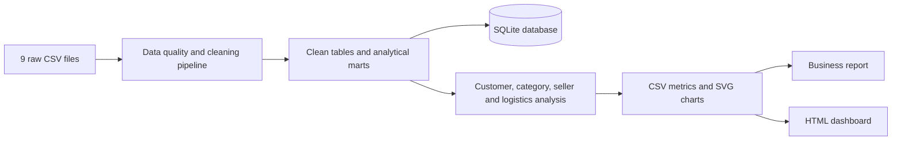

# Olist Brazil E-commerce Operations Analysis

An end-to-end analytics project that turns nine raw Olist marketplace datasets
into a reproducible operations diagnosis, customer analysis, and growth action
plan. The workflow covers data quality, analytical marts, customer RFM,
category performance, seller performance, delivery risk, reviews, and an HTML
operations dashboard.


## Dashboard preview


The generated dashboard is available at
[`outputs/dashboard.html`](outputs/dashboard.html). Download or clone the
repository and open the file in a browser to view the full dashboard.

## Executive summary

The baseline uses delivered orders and includes complete trend months through
August 2018.

| KPI | Result | Operational meaning |
|---|---:|---|
| Completed orders | 96,478 | Delivered-order analysis base |
| Merchandise GMV | R$13.22M | Product value excluding freight |
| Active buyers | 93,358 | Unique customers with completed orders |
| Average order value | R$137.04 | Merchandise GMV per completed order |
| Repeat buyer rate | 3.00% | Retention is the clearest growth gap |
| Late delivery rate | 8.11% | Material service-risk population |
| Average delivery time | 12.13 days | Purchase-to-delivery cycle time |
| Average review score | 4.16 / 5 | Overall delivered-order satisfaction |

## Key findings and recommendations

1. **Retention is the largest growth opportunity.** Only 3.00% of buyers made
   repeat purchases in the observed period. Build lifecycle journeys around
   the generated RFM segments, beginning with new-active, loyal, champion, and
   at-risk customers.
2. **Late delivery is strongly associated with poor reviews.** On-time orders
   average 4.29 stars, compared with 2.57 for late orders. Prioritize high-volume
   state and seller combinations with elevated delay rates.
3. **Marketplace demand scaled rapidly during 2017.** Orders and merchandise
   GMV rose materially, with November 2017 producing the largest complete-month
   volume. Treat this as a seasonal planning signal rather than proof of a
   campaign effect.
4. **Category decisions should balance sales and experience.** High-GMV
   categories with weak ratings or high freight burden require quality and
   logistics actions before additional promotion.
5. **Regional service levels are uneven.** Use state-level GMV, delivery time,
   delay rate, and review score together to allocate operational attention by
   both commercial impact and customer risk.

See the full diagnosis in
[`outputs/analysis_report.md`](outputs/analysis_report.md).

## Reproducible workflow



### 1. Clone and create an environment

```powershell
git clone https://github.com/LeoYoxi666/olist-brazil-ecommerce-analysis.git
cd olist-brazil-ecommerce-analysis
py -m venv .venv
.\.venv\Scripts\Activate.ps1
python -m pip install --upgrade pip
python -m pip install -r requirements.txt
```

If PowerShell blocks activation, allow scripts only for the current terminal:

```powershell
Set-ExecutionPolicy -Scope Process -ExecutionPolicy RemoteSigned
.\.venv\Scripts\Activate.ps1
```

### 2. Add the source data

Place these nine unchanged CSV files in `data/raw/`:

```text
olist_customers_dataset.csv
olist_geolocation_dataset.csv
olist_order_items_dataset.csv
olist_order_payments_dataset.csv
olist_order_reviews_dataset.csv
olist_orders_dataset.csv
olist_products_dataset.csv
olist_sellers_dataset.csv
product_category_name_translation.csv
```

Raw and processed data are excluded from Git because they are large and can be
recreated from the public Olist dataset.

### 3. Run the complete analysis

Run each stage from the project root:

```powershell
python scripts/run_pipeline.py
python scripts/run_analysis.py
python scripts/run_dashboard.py
python -m pytest -q
```

Expected verification result:

```text
Built 13 tables
Quality checks: 12
Generated 7 analysis tables
2 passed
```

Open the dashboard on Windows:

```powershell
Start-Process .\outputs\dashboard.html
```

## Project structure

```text
olist-brazil-ecommerce-analysis/
|-- configs/                    # Reserved project configuration
|-- data/
|   |-- raw/                    # Nine source CSV files (not tracked)
|   `-- processed/              # Clean tables, marts and SQLite (not tracked)
|-- docs/
|   |-- assets/                 # README presentation assets
|   |-- data_dictionary.md      # Dataset keys and relationships
|   `-- data_cleaning_rules.md  # Cleaning and metric rules
|-- outputs/
|   |-- analysis/               # Metric tables and SVG charts
|   |-- analysis_report.md      # Business diagnosis
|   `-- dashboard.html          # Standalone operations dashboard
|-- scripts/                    # Pipeline entry points
|-- src/olist_analysis/         # Reusable processing and analysis package
|-- tests/                      # Automated pipeline tests
|-- pyproject.toml              # Python tooling configuration
`-- requirements.txt            # Reproducible dependencies
```

## Main analytical outputs

| Artifact | Purpose |
|---|---|
| `order_mart.csv` | One row per order with customer, delivery, payment, and review metrics |
| `item_mart.csv` | Item-, product-, category-, seller-, price-, and freight-level analysis |
| `user_mart.csv` | Customer recency, frequency, monetary value, and RFM segment |
| `seller_mart.csv` | Seller volume, GMV, freight, delivery, and satisfaction performance |
| `olist_analysis.sqlite` | Thirteen cleaned and analytical tables for SQL exploration |
| `data_quality_report.json` | Row counts, keys, missingness, and validation results |
| `analysis/*.csv` | Monthly, category, state, seller, RFM, and logistics metrics |
| `analysis/*.svg` | Version-controlled charts used by the dashboard |

## Metric and quality controls

- Source CSVs remain unchanged in `data/raw/`.
- Order-level KPIs use delivered orders as completed transactions.
- Trend analysis stops at August 2018 to avoid incomplete trailing months.
- Invalid timestamps are coerced to missing values and monitored.
- Duplicate primary keys, join coverage, missingness, and output row counts are
  checked by the pipeline.
- Monetary metrics distinguish merchandise value, freight, and payments.
- Reusable transformations live in `src/`; scripts only orchestrate stages.

Detailed definitions are documented in
[`docs/data_dictionary.md`](docs/data_dictionary.md) and
[`docs/data_cleaning_rules.md`](docs/data_cleaning_rules.md).

## Technology

- Python 3.10+
- pandas and NumPy
- SQLite
- HTML, CSS, and SVG
- pytest, Black, isort, Flake8, and mypy
- Git and GitHub

## Analytical limitations

The source data does not include campaign exposure, advertising spend, product
cost, marketplace commission, or browsing behavior. The project therefore does
not claim causal marketing lift, advertising ROI, accounting profit, or funnel
conversion. Relationships such as delivery delay and review score are
diagnostic associations, not controlled causal estimates.
