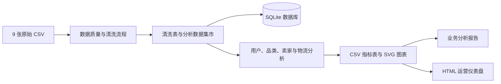

# Olist 巴西电商运营分析

本项目将 9 张 Olist 巴西电商原始数据表转化为可复现的运营诊断、用户分析与
增长行动方案。分析覆盖数据质量、主题数据集市、用户 RFM、品类与卖家表现、
配送风险、用户评价和独立 HTML 运营仪表盘。


[](https://github.com/LeoYoxi666/olist-brazil-ecommerce-analysis/actions/workflows/ci.yml)


## 1. 在线仪表盘


**在线版本：**
[打开 Olist 运营仪表盘](https://leoyoxi666.github.io/olist-brazil-ecommerce-analysis/)

本地生成版本位于
[`outputs/dashboard.html`](outputs/dashboard.html)。克隆或下载项目后，可直接使用
浏览器打开该文件。

## 2. 管理摘要

核心指标以已交付订单为基准，完整趋势窗口截至 2018 年 8 月。

| 指标 | 结果 | 运营含义 |
|---|---:|---|
| 已完成订单 | 96,478 | 已交付订单分析基准 |
| 商品 GMV | R$13.22M | 不含运费的商品金额 |
| 活跃买家 | 93,358 | 至少有一笔已完成订单的去重用户 |
| 平均订单金额 | R$137.04 | 每笔已完成订单的商品 GMV |
| 复购买家率 | 3.00% | 用户留存是最明显的增长缺口 |
| 延迟交付率 | 8.11% | 存在明确的服务风险客群 |
| 平均交付时长 | 12.13 天 | 从下单到交付的平均周期 |
| 平均评价得分 | 4.16 / 5 | 已交付订单的整体满意度 |

### 2.1 管理决策优先级

| 优先事项 | 当前信号 | 历史影响范围 | 商品 GMV | 建议行动 |
|---|---:|---:|---:|---|
| 用户留存增长 | 复购买家率 3.00% | 74,153 名合格目标用户 | R$10.37M | 按客群开展带留出组的实验 |
| 配送服务改善 | 延迟交付率 8.11% | 7,826 笔延迟订单 | R$1.16M | 复核卖家发货与承运线路 |
| 品类体验优化 | 重点品类评分 4.01 / 5 | 6 个高 GMV 且低于平台均值的品类 | R$4.98M | 增长前先解决质量与运费问题 |

以上商业金额表示诊断范围内的历史商品 GMV，不代表预测增量、可追回收入或会计利润。

## 3. 核心结论与建议

1. **用户留存是最大的增长机会。** 观察期内仅 3.00% 的买家发生复购。按月精确
   留存率在第 1、3、6 个月分别为 0.48%、0.26% 和 0.23%。cohort-RFM 队列中
   有 41 个同时满足规模和可观察期要求的客群，第一优先级为 2017 年 11 月的
   `at_risk` 客群，共 2,702 名目标用户。
2. **延迟交付与低评分明显相关。** 准时订单平均评分为 4.29，延迟订单为 2.57。
   应用最小样本量门槛后，24 个州和 804 个卖家进入风险排序；最终生成 1,886 条
   按受影响延迟订单量排序的卖家—州行动线路。
3. **2017 年平台需求快速增长。** 订单量和商品 GMV 明显上升，2017 年 11 月是
   完整月份中的峰值。该现象可用于季节性规划，但不能证明某项营销活动的因果效果。
4. **品类决策需要同时考虑销售与体验。** 高 GMV、低评分或高运费负担品类，应先
   解决商品质量和物流问题，再追加推广。
5. **不同地区的服务水平不均衡。** 应结合州级 GMV、交付时长、延迟率和评价得分，
   按商业影响和用户风险配置运营资源。

完整诊断见
[`outputs/analysis_report.md`](outputs/analysis_report.md)。

## 4. 可复现运行流程



### 4.1 克隆项目并创建环境

```powershell
git clone https://github.com/LeoYoxi666/olist-brazil-ecommerce-analysis.git
cd olist-brazil-ecommerce-analysis
py -m venv .venv
.\.venv\Scripts\Activate.ps1
python -m pip install --upgrade pip
python -m pip install -r requirements.txt
```

如果 PowerShell 阻止激活脚本，仅为当前终端临时放行：

```powershell
Set-ExecutionPolicy -Scope Process -ExecutionPolicy RemoteSigned
.\.venv\Scripts\Activate.ps1
```

### 4.2 放置原始数据

将以下 9 个未经修改的 CSV 文件放入 `data/raw/`：

```text
olist_customers_dataset.csv
olist_geolocation_dataset.csv
olist_order_items_dataset.csv
olist_order_payments_dataset.csv
olist_order_reviews_dataset.csv
olist_orders_dataset.csv
olist_products_dataset.csv
olist_sellers_dataset.csv
product_category_name_translation.csv
```

原始数据和处理后数据体积较大且可由公开 Olist 数据集重新生成，因此不会提交到 Git。

### 4.3 运行完整分析

在项目根目录依次执行：

```powershell
python scripts/run_pipeline.py
python scripts/run_analysis.py
python scripts/run_dashboard.py
python -m pytest -q
```

预期验证结果：

```text
Built 13 tables
Quality checks: 12
Generated 11 analysis tables
9 passed
```

在 Windows 中打开本地仪表盘：

```powershell
Start-Process .\outputs\dashboard.html
```

## 5. 项目结构

```text
olist-brazil-ecommerce-analysis/
|-- configs/                    # 预留项目配置
|-- data/
|   |-- raw/                    # 9 张原始 CSV，不纳入版本控制
|   `-- processed/              # 清洗表、数据集市与 SQLite，不纳入版本控制
|-- docs/
|   |-- assets/                 # README 展示资源
|   |-- cohort_retention_methodology.md
|   |-- cohort_rfm_targeting_methodology.md
|   |-- delivery_risk_methodology.md
|   |-- executive_summary_methodology.md
|   |-- portfolio_summary.md
|   |-- data_dictionary.md      # 数据键与表关系
|   `-- data_cleaning_rules.md  # 清洗与指标规则
|-- outputs/
|   |-- analysis/               # 指标表与 SVG 图表
|   |-- analysis_report.md      # 业务诊断报告
|   `-- dashboard.html          # 独立运营仪表盘
|-- scripts/                    # 分析流程入口
|-- src/olist_analysis/         # 可复用处理与分析包
|-- tests/                      # 自动化测试
|-- pyproject.toml              # Python 工具配置
`-- requirements.txt            # 可复现依赖
```

## 6. 主要分析产物

| 产物 | 用途 |
|---|---|
| `order_mart.csv` | 订单级用户、配送、支付和评价指标 |
| `item_mart.csv` | 商品明细、品类、卖家、价格和运费分析 |
| `user_mart.csv` | 用户最近购买、购买频次、消费金额和 RFM 分群 |
| `seller_mart.csv` | 卖家订单量、GMV、运费、配送和满意度表现 |
| `olist_analysis.sqlite` | 用于 SQL 探索的 13 张清洗及分析表 |
| `data_quality_report.json` | 行数、键、缺失值和验证结果 |
| `analysis/*.csv` | 月度、cohort、品类、州、卖家、RFM 和物流指标 |
| `analysis/*.svg` | 仪表盘使用的版本化图表 |
| `cohort_retention.csv` | 月度 cohort 规模、活跃买家与留存率 |
| `cohort_rfm_targets.csv` | 合格 cohort-RFM 留存行动队列 |
| `executive_summary.csv` | 包含历史影响范围的三项管理决策摘要 |
| `seller_state_delivery_actions.csv` | 满足样本门槛的卖家—州配送复核队列 |

## 7. 指标与质量控制

- `data/raw/` 中的原始 CSV 始终保持不变。
- 订单级核心指标以已交付订单作为完成交易。
- 趋势分析截至 2018 年 8 月，避免纳入不完整尾部月份。
- 无效时间戳会被转为空值并纳入监控。
- 流程检查主键重复、关联覆盖率、缺失值和输出行数。
- 分析阶段向 `data_quality_report.json` 追加 RFM 用户完整性和 cohort 目标排序检查。
- 金额指标明确区分商品金额、运费和支付金额。
- RFM 评分保留并列值；购买频次使用实际已完成订单数并封顶为 5，避免将相同的
  一次购买用户错误划入忠诚客群。
- cohort-RFM 优先客群至少包含 100 名买家，并具有 3 个可观察后续月份。
- 配送风险排序要求州、卖家、卖家—州线路分别至少有 100、20、10 笔已完成订单；
  合格记录依次按延迟订单数、延迟率和商品 GMV 排序。
- 可复用转换逻辑位于 `src/`，`scripts/` 仅负责流程编排。

详细定义见[数据字典](docs/data_dictionary.md)和
[数据清洗规则](docs/data_cleaning_rules.md)。相关方法说明包括
[用户 cohort 留存方法](docs/cohort_retention_methodology.md)、
[cohort-RFM 目标客群方法](docs/cohort_rfm_targeting_methodology.md)、
[管理决策摘要方法](docs/executive_summary_methodology.md)和
[配送风险排序方法](docs/delivery_risk_methodology.md)。
[简历与面试介绍](docs/portfolio_summary.md)提供可直接使用的中文项目描述。

## 8. 技术栈

- Python 3.10+
- pandas 与 NumPy
- SQLite
- HTML、CSS 与 SVG
- pytest、Black、isort、Flake8 与 mypy
- Git 与 GitHub Actions

## 9. 分析边界

原始数据不包含营销活动曝光、广告支出、商品成本、平台佣金或浏览行为，因此本项目
不推断营销因果增量、广告 ROI、会计利润或漏斗转化。延迟交付与评价得分等关系仅表示
诊断性关联，不是受控实验得到的因果估计。
