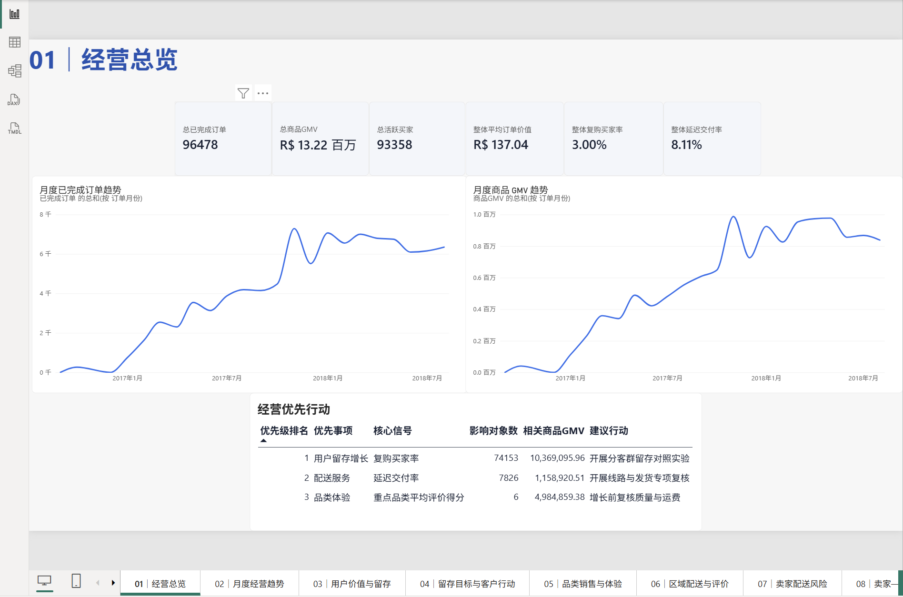
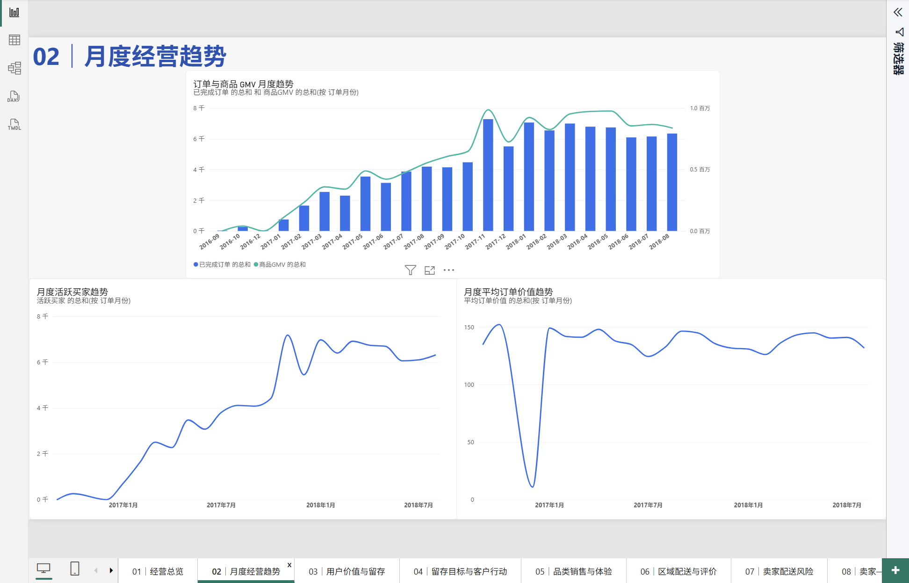
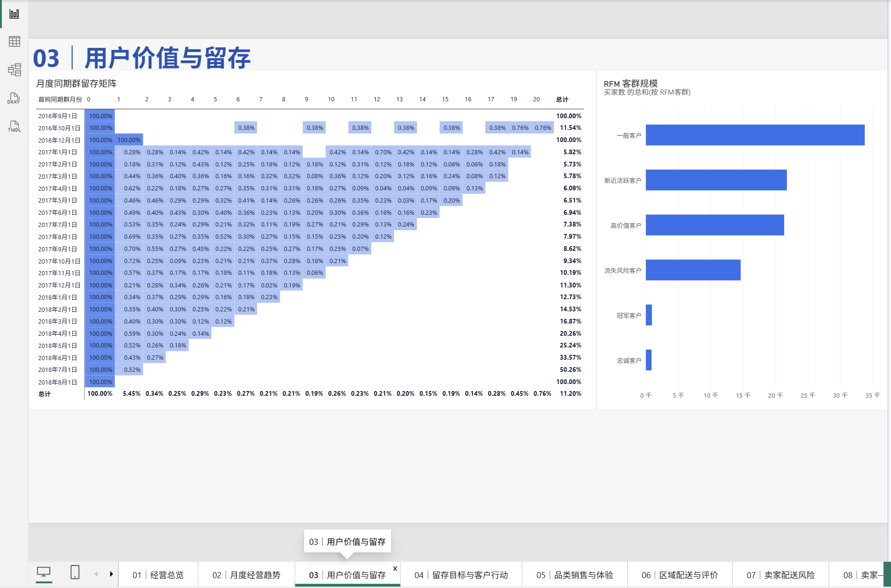
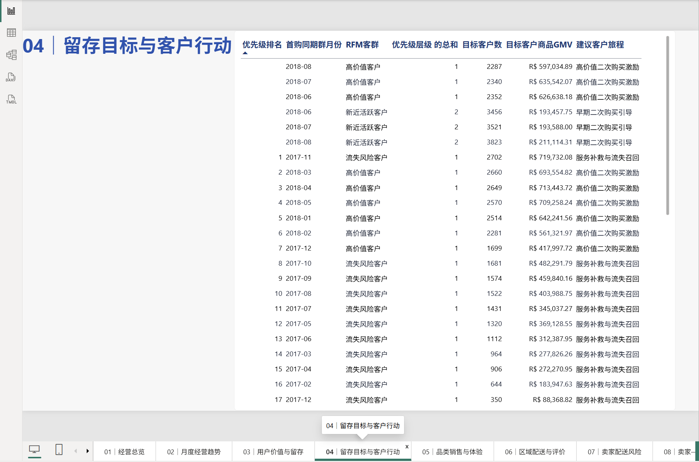
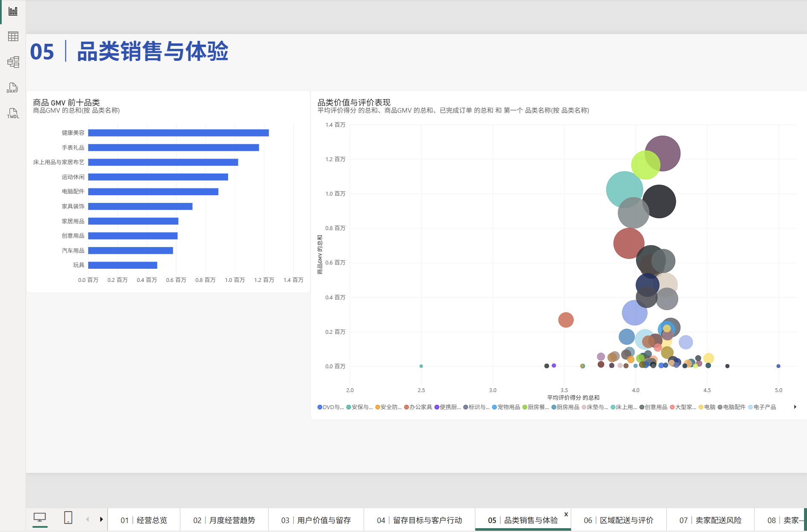
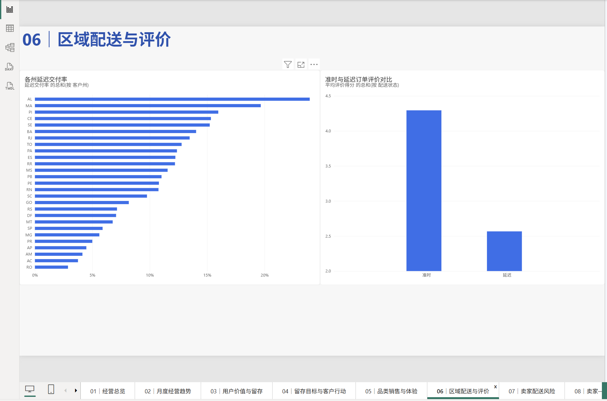
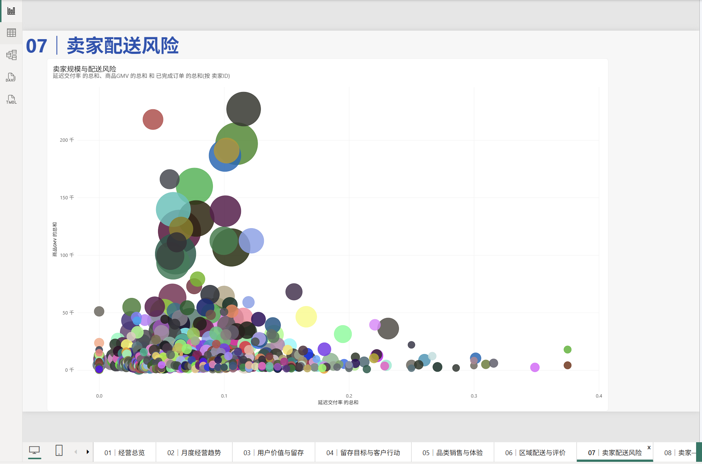
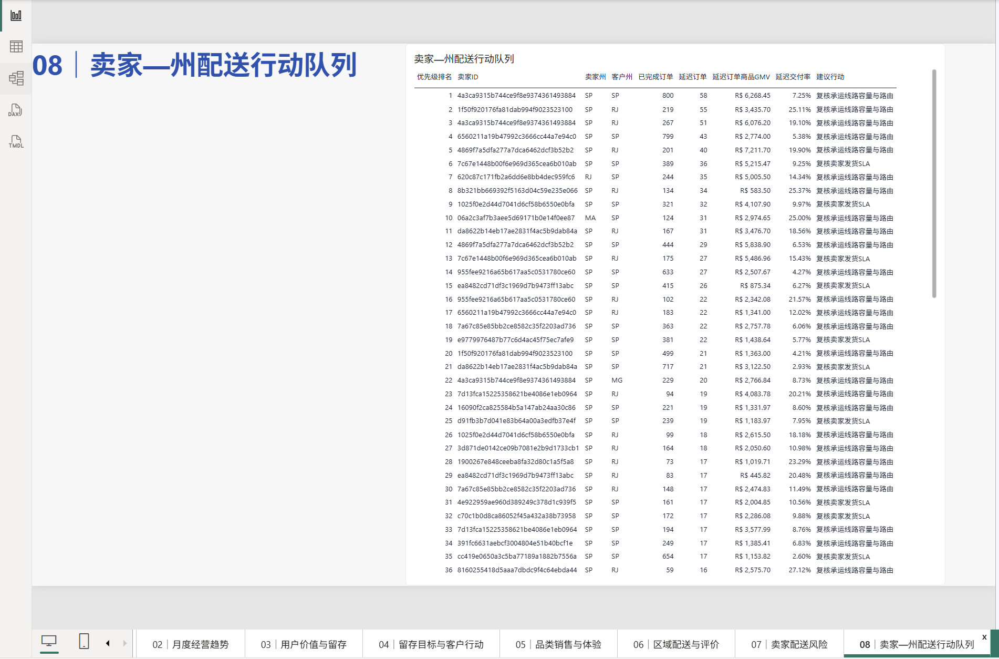

# Olist 巴西电商运营诊断报告

## 1. 分析范围

本报告以已交付订单作为完成交易基准，趋势分析截至
`2018-08`。数据不包含广告曝光、商品成本或平台佣金，
因此不对广告活动因果关系、广告投资回报率或会计利润作出结论。

风险排名要求每个州至少有 100 笔已完成订单、每个卖家至少有
20 笔已完成订单、每条卖家—州线路至少有
10 笔已完成订单。这些是运营样本量门槛，
不代表统计显著性检验。

## 2. 管理指标基准

| 指标 | 数值 |
|---|---:|
| 已完成订单 | 96,478 |
| 商品 GMV | R$13,221,498.11 |
| 活跃买家 | 93,358 |
| 平均交付天数 | 12.13 |
| 延迟交付率 | 8.11% |
| 平均评价得分 | 4.16 / 5 |

## 3. 管理决策优先级

| 排名 | 优先领域 | 当前信号 | 历史范围 | 商品 GMV | 建议下一步行动 |
|---:|---|---:|---:|---:|---|
| 1 | 用户留存增长 | 3.00% | 74,153 名合格目标用户 | R$10,369,095.96 | 按客群开展带留出组的留存实验 |
| 2 | 配送服务改善 | 8.11% | 7,826 笔延迟订单 | R$1,158,920.51 | 复核卖家发货与承运线路 |
| 3 | 品类体验优化 | 4.01 / 5 | 6 个高 GMV 且评分低于平台均值的品类 | R$4,984,859.38 | 增长前先复核商品质量与运费 |

商业价值表示诊断范围内的历史商品 GMV，不是预测增量、可挽回收入或会计利润。

## 4. 主要发现

1. **2017 年业务规模明显增长。** 月度 GMV 与订单图显示业务快速上升，
   2017 年 11 月是完整月份中的高点。这是季节性信号，不是某次营销活动产生效果的证明。
2. **用户留存是最明确的增长机会。** 加权 cohort 留存率在第 1、3、6 个月分别为
   0.48%、0.26% 和 0.23%；
   共有 41 个 cohort-RFM 客群满足样本量和观察期门槛。
   首要目标为 2017-11 的“流失风险用户”客群，包含 2,702 名目标用户，对应 R$719,732.08 商品 GMV。
3. **延迟交付与较差满意度密切相关。** 准时订单平均评分为
   4.29，延迟订单为
   2.57。该关系用于运营诊断，
   不能解释为因果实验结果。
4. **配送风险足够集中，可以定向处理。** 共有 24 个州和
   804 个卖家满足最低样本量门槛。首要合格线路为卖家 `4a3ca9315b744ce9f8e9374361493884` （SP 至 SP），800 笔已完成订单中有 58 笔延迟。
5. **品类质量需要与销售规模共同管理。** 品类结果同时纳入 GMV、运费占比和评分；
   对高销量、低评分品类不能只按销售规模进行优化。

## 5. 建议行动

1. 按优先级处理 `cohort_rfm_targets.csv`。将建议旅程作为实验假设，保留留出组，
   衡量增量复购和增量 GMV，而不是只比较活动后的原始总量。
2. 按优先级处理 `seller_state_delivery_actions.csv`。当发货环节占交付时间至少
   35% 时复核卖家发货 SLA，否则优先复核承运线路容量与路由。
3. 提出选品或促销调整前，先复核高 GMV 但评分偏低或运费占比较高的重点品类。
4. 每个干预窗口结束后重新计算行动队列，同时比较延迟订单量和用户评价变化。

## 6. Power BI 可视化方案

Power BI 使用 `../powerbi/data/` 中的 11 张全中文轻量聚合表，不直接加载原始明细。最终看板包含
经营总览、月度经营趋势、用户价值与留存、留存目标与客户行动、品类销售与体验、
区域配送与评价、卖家配送风险、卖家—州配送行动队列八个页面。指标计算、RFM 分群、
cohort 资格判断和风险排序继续由 Python 分析层负责，
Power BI 只承担筛选、聚合与交互展示，避免在不同工具中形成两套业务口径。

刷新入口为 `../powerbi/refresh_exports.ps1`，中文字段布局、中文 DAX 度量值、统一主题和验收规则见
`../powerbi/build_guide.md`。以下截图来自已完成并验收的本地 `.pbix`。

### 6.1 经营总览

96,478 笔已完成订单贡献 R$13.22M 商品 GMV，但复购买家率仅 3.00%；管理优先级应首先聚焦留存增长，其次处理 8.11% 的延迟交付风险和重点品类体验。

### 6.2 月度经营趋势

订单量、商品 GMV 与活跃买家在 2017 年快速增长，2017 年 11 月达到完整月份高点，之后进入相对稳定区间。趋势用于容量和季节性规划，不代表营销因果效果。

### 6.3 用户价值与留存

一般客户是最大 RFM 客群；同期群在首购后快速流失，第 1、3、6 月加权精确留存率分别为 0.48%、0.26% 和 0.23%。

### 6.4 留存目标与客户行动

行动队列把 cohort、RFM 客群、目标客户数、历史商品 GMV 和建议旅程放在同一视图中；其中 41 个客群满足规模与可观察期门槛，应通过留出组验证增量效果。

### 6.5 品类销售与体验

健康美容、手表礼品等品类贡献较高商品 GMV。品类扩张不能只看销售规模，应优先复核高 GMV、低评分或高运费负担的体验风险。

### 6.6 区域配送与评价

州际延迟交付率差异明显；延迟订单平均评分为 2.57，显著低于准时订单的 4.29，支持按影响规模配置配送改进资源。

### 6.7 卖家配送风险

风险散点图同时呈现卖家延迟率、商品 GMV 和订单规模。应优先处理延迟率较高且业务影响范围较大的卖家，而不是只追逐最高延迟率的小样本异常点。

### 6.8 卖家—州配送行动队列

线路级队列按延迟订单量、延迟率和商品 GMV 排序。首要合格线路为卖家 `4a3ca9315b744ce9f8e9374361493884` （SP 至 SP），800 笔已完成订单中有 58 笔延迟。 建议行动用于区分卖家发货 SLA 与承运线路容量、路由复核方向。

## 7. 生成产物

- [月度 GMV 图](analysis/monthly_gmv.svg)
- [月度订单图](analysis/monthly_orders.svg)
- [重点品类图](analysis/top_categories_gmv.svg)
- [各州延迟交付图](analysis/state_late_delivery.svg)
- [用户 cohort 留存热力图](analysis/cohort_retention.svg)
- [cohort-RFM 留存优先级图](analysis/cohort_rfm_targets.svg)
- `executive_summary.csv`：三行管理决策摘要
- `cohort_rfm_targets.csv`：满足样本量和观察期门槛的留存行动队列
- `seller_state_delivery_actions.csv`：满足门槛的线路级行动队列

排名逻辑和解释边界见 `../docs/executive_summary_methodology.md`、
`../docs/cohort_rfm_targeting_methodology.md` 和
`../docs/delivery_risk_methodology.md`。

## 8. 数据来源与许可

原始数据来自 Olist 在 Kaggle 发布的
[Brazilian E-Commerce Public Dataset by Olist](https://www.kaggle.com/datasets/olistbr/brazilian-ecommerce)，
Kaggle 元数据标注许可为
[CC BY-NC-SA 4.0](https://creativecommons.org/licenses/by-nc-sa/4.0/)。原始 CSV 不纳入
Git，使用者需自行下载并遵守署名、非商业和相同方式共享要求。本项目原创代码采用
[MIT License](../LICENSE)，该许可不扩展到 Olist 数据或其他第三方内容。
